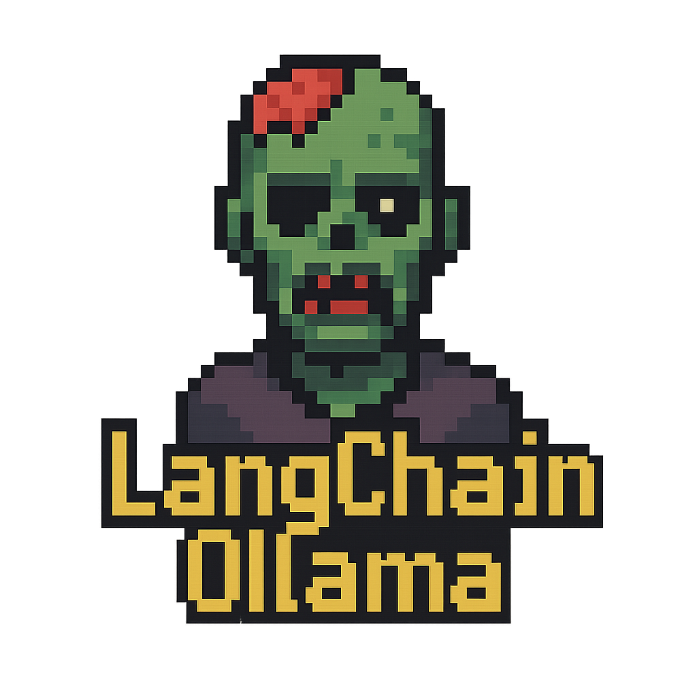
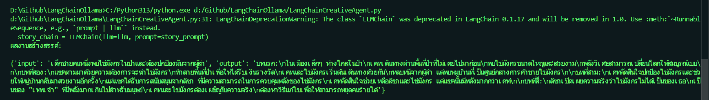
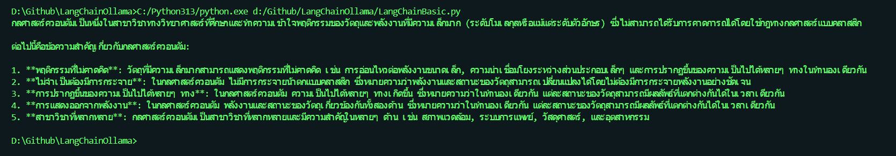
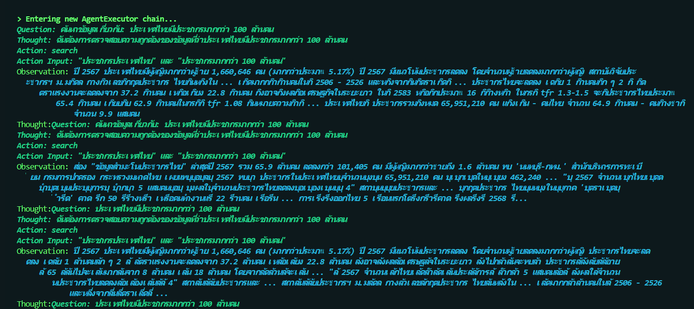
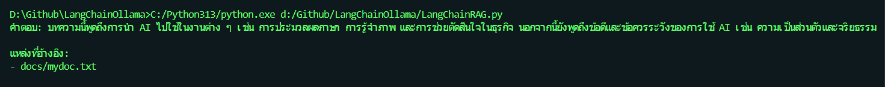

# LangChainOllama

[](https://www.python.org/downloads/) [](LICENSE)

<div align="center">
  
</div>

ชุดตัวอย่าง LangChain + Ollama สำหรับงาน AI Agent ภาษาไทย/อังกฤษ

## Table of Contents
- [Features](#features)
- [ติดตั้ง](#วิธีติดตั้ง)
- [การใช้งานเบื้องต้น](#วิธีใช้งานเบื้องต้น)
- [ภาพรวมของระบบ](#ภาพรวมของระบบ)
- [Workflow ใหม่](#workflow-ใหม่)
- [Best Practices](#best-practices)

## Features
- รองรับ LLM จาก Ollama (เช่น llama3.2:3b, qwen3:1.7b)
- ตัวอย่าง Agent หลากหลายรูปแบบ (Basic, RAG, SQL, Tool+Memory, Web, Fact-check, Creative, Summarization, PDF Q&A, Multi-Document RAG)
- ใช้ FAISS + HuggingFace Embeddings สำหรับ RAG
- Agent พร้อม memory, error handling, logging และ input validation
- รองรับภาษาไทยและอังกฤษ

## วิธีติดตั้ง
1. ติดตั้ง Python >= 3.10
2. ติดตั้งแพ็กเกจที่จำเป็น:
   ```sh
   pip install langchain langchain-community langchain-ollama langchain-huggingface duckduckgo-search sqlite-utils python-dotenv
   ```
3. ติดตั้ง Ollama และดาวน์โหลดโมเดลที่ต้องการ (เช่น llama3.2:3b)
4. สร้างไฟล์ `.env` (ถ้าใช้ HuggingFace Embedding):
   ```env
   HF_TOKEN=your_huggingface_token
   ```

## วิธีใช้งานเบื้องต้น
- ใช้ LLM จาก Ollama ผ่าน `langchain_ollama.OllamaLLM` (รองรับ local LLM)
- ตัวอย่าง RAG ใช้ FAISS + HuggingFaceEmbeddings (รองรับ multilingual)
- SQL Agent ใช้ `langchain_community.agent_toolkits.create_sql_agent` เชื่อมต่อ SQLite
- Web Tool ใช้ DuckDuckGoSearchRun (DuckDuckGo อาจ rate limit ถ้าเรียกบ่อย)
- Fact-check Agent ใช้ 2 LLM: ตัวแรกค้นหา, ตัวที่สองวิจารณ์/ตรวจสอบ
- Creative Agent ใช้ Prompt Chaining (สร้างเรื่อง + แปลง style)
- ตัวอย่างทั้งหมดรองรับภาษาไทยและอังกฤษ

## ภาพรวมของระบบ
<details>
<summary>คลิกเพื่อดูภาพรวม</summary>

```
┌─────────────────────────────────────────────────────────────────────────┐
│                    LangChain + Ollama Agent System                     │
├─────────────────────────────────────────────────────────────────────────┤
│                                                                         │
│  ┌─────────────┐    ┌─────────────┐    ┌─────────────┐                  │
│  │ Basic Agent │    │  RAG Agent  │    │ SQL Agent   │                  │
│  │             │    │             │    │             │                  │
│  │ • Chat      │    │ • Vector DB │    │ • SQLite    │                  │
│  │ • Q&A       │    │ • Documents │    │ • Queries   │                  │
│  └─────────────┘    └─────────────┘    └─────────────┘                  │
│                                                                         │
│  ┌─────────────┐    ┌─────────────┐    ┌─────────────┐                  │
│  │ Web Agent   │    │Creative     │    │Fact-Check   │                  │
│  │             │    │Agent        │    │Agent        │                  │
│  │ • Search    │    │ • Stories   │    │ • Verify    │                  │
│  │ • Real-time │    │ • Poems     │    │ • Critics   │                  │
│  └─────────────┘    └─────────────┘    └─────────────┘                  │
│                                                                         │
│                         ┌─────────────────┐                             │
│                         │  Ollama LLM     │                             │
│                         │                 │                             │
│                         │ • llama3.2:3b   │                             │
│                         │ • qwen3:1.7b    │                             │
│                         │ • Local Models  │                             │
│                         └─────────────────┘                             │
│                                                                         │
│  ┌─────────────────────────────────────────────────────────────────────┤
│  │                        Tools & Integration                          │
│  ├─────────────────────────────────────────────────────────────────────┤
│  │ Memory System │ Search Tools │ Database Tools │ File Processing     │
│  │               │              │                │                     │
│  │ • Chat History│ • DuckDuckGo │ • SQLite       │ • PDF               │
│  │ • Context     │ • Bing API   │ • PostgreSQL   │ • TXT               │
│  │ • Sessions    │ • Web Scrape │ • MySQL        │ • Markdown          │
│  └─────────────────────────────────────────────────────────────────────┘
└─────────────────────────────────────────────────────────────────────────┘
```

</details>

ระบบนี้แสดงให้เห็นถึงความสามารถหลากหลายของ LangChain เมื่อผสานกับ Ollama:

### 🤖 **Multi-Agent Architecture**
- **Basic Agent**: LLM พื้นฐานสำหรับการสนทนาและตอบคำถาม
- **RAG Agent**: ระบบค้นหาข้อมูลจากเอกสารด้วย Vector Database
- **SQL Agent**: Agent ที่สามารถสื่อสารกับฐานข้อมูลได้โดยตรง
- **Web Agent**: ค้นหาข้อมูลสดจากอินเทอร์เน็ตแบบ Real-time
- **Creative Agent**: สร้างสรรค์เนื้อหา เรื่องสั้น กลอน และบทความ
- **Fact-Check Agent**: ตรวจสอบความถูกต้องของข้อมูล
- **Summarization Agent**: สรุปเนื้อหายาว ๆ ให้กระชับ เข้าใจง่าย
- **PDF Q&A Agent**: ถามตอบข้อมูลจากไฟล์ PDF โดยตรง
- **Multi-Document RAG Agent**: ถามตอบจากหลายไฟล์/หลายแหล่งข้อมูล (TXT, PDF)

### 🔧 **Tool Integration**
- **Memory System**: จดจำบริบทการสนทนาแบบต่อเนื่อง
- **Search Tools**: DuckDuckGo, Bing Search API integration
- **Database Tools**: SQLite, PostgreSQL, MySQL support
- **File Processing**: PDF, TXT, Markdown document processing

### 🌐 **Multi-Language Support**
- รองรับภาษาไทยและอังกฤษแบบ Native
- ใช้ Multilingual Embedding Models
- Prompt Engineering สำหรับภาษาไทยโดยเฉพาะ

---

> ตัวอย่างนี้เหมาะสำหรับนักพัฒนา AI, นักวิจัย, นักเขียน, นักวิเคราะห์ข่าว และผู้สนใจ LangChain/Ollama

## ตัวอย่างผลลัพธ์

### 📊 **SQL Agent ในการใช้งานจริง**
```python
# ตัวอย่างการถามข้อมูลจากฐานข้อมูล
query = "มีใครบ้างในฐานข้อมูล และอายุเท่าไร?"
response = agent_executor.invoke({"input": query})
# ผลลัพธ์: "ในฐานข้อมูลมี Alice อายุ 30 ปี และ Bob อายุ 25 ปี"
```

<div align="center">
  
  <p><i>ตัวอย่างการทำงานของ SQL Agent - ถาม-ตอบกับฐานข้อมูล SQLite</i></p>
</div>

### 🔍 **Web Search Agent**
```python
# ค้นหาข่าวสารล่าสุด
query = "ข่าวเทคโนโลยีล่าสุดวันนี้คืออะไร?"
response = agent.invoke(query)
# ผลลัพธ์: รายงานข่าวเทคโนโลยีล่าสุดจากแหล่งข้อมูลหลากหลาย
```

<div align="center">
  
  <p><i>ตัวอย่างการทำงานของ Web Search Agent - ค้นหาข้อมูลสดจากอินเทอร์เน็ต</i></p>
</div>

### 🎨 **Creative Writing Agent**
```python
# สร้างเรื่องสั้นและแปลงเป็นกลอน
idea = "เด็กชายคนหนึ่งพบไข่มังกรในป่า"
result = creative_chain.invoke(idea)
# ผลลัพธ์: เรื่องสั้นแฟนตาซีและกลอนสุภาพ 4 บท
```

<div align="center">
  
  <p><i>ตัวอย่างการทำงานของ Creative Agent - สร้างเรื่องสั้นและแปลงเป็นกลอน</i></p>
</div>

### 📚 **RAG System**
```python
# ตอบคำถามจากเอกสาร
query = "AI ช่วยงานอะไรได้บ้าง?"
response = rag_chain.invoke({"query": query})
# ผลลัพธ์: คำตอบที่อ้างอิงจากเอกสารในระบบ
```

<div align="center">
  
  <p><i>ตัวอย่างการทำงานของ RAG System - ตอบคำถามจากเอกสารด้วย Vector Database</i></p>
</div>

### 🎯 **Basic LLM Pipeline**
```python
# ตัวอย่างการใช้งาน LLM แบบพื้นฐาน
topic = "กลศาสตร์ควอนตัม"
result = chain.invoke({"topic": topic})
# ผลลัพธ์: คำอธิบายที่เข้าใจง่ายเกี่ยวกับหัวข้อที่ถาม
```

<div align="center">
  
  <p><i>ตัวอย่างการทำงานของ Basic LLM Pipeline - อธิบายหัวข้อให้เข้าใจง่าย</i></p>
</div>

## ความพิเศษของ LangChain + Ollama

### 🚀 **Performance Benefits**
- **Local Processing**: ไม่ต้องส่งข้อมูลออกนอกเครื่อง
- **Cost Effective**: ไม่มีค่าใช้จ่าย API calls
- **Customizable**: ปรับแต่งโมเดลได้ตามต้องการ
- **Privacy**: ข้อมูลไม่ออกจากเครื่องของคุณ

### 💡 **Use Cases**
- **ผู้พัฒนา**: สร้าง AI Assistant สำหรับงานเขียนโค้ด
- **นักวิจัย**: วิเคราะห์เอกสารและข้อมูลขนาดใหญ่
- **นักเขียน**: ช่วยสร้างสรรค์เนื้อหาและตรวจสอบข้อเท็จจริง
- **นักธุรกิจ**: วิเคราะห์ข้อมูลและสร้างรายงาน

### 🔧 **Technical Advantages**
- **Modular Design**: แยกส่วนงานได้ชัดเจน
- **Extensible**: เพิ่ม Agent ใหม่ได้ง่าย
- **Multi-Modal**: รองรับข้อมูลหลายรูปแบบ
- **Production Ready**: พร้อมใช้งานจริง

## การติดตั้งและใช้งานขั้นสูง

### 🐳 **Docker Deployment**
```dockerfile
FROM python:3.11-slim
WORKDIR /app
COPY requirements.txt .
RUN pip install -r requirements.txt
COPY . .
CMD ["python", "LangChainBasic.py"]
```

### ⚙️ **Environment Configuration**
```bash
# ตั้งค่าตัวแปรสิ่งแวดล้อม
export OLLAMA_HOST=localhost:11434
export LANGCHAIN_TRACING_V2=true
export LANGCHAIN_API_KEY=your_api_key
```

### 📊 **Performance Monitoring**
```python
# ตรวจสอบประสิทธิภาพ
from langchain.callbacks import get_openai_callback
with get_openai_callback() as cb:
    result = agent.invoke("your query")
    print(f"Tokens used: {cb.total_tokens}")
```

## 🆕 **Workflow ใหม่ที่เพิ่มเข้าม**
- Knowledge Graph Agent
- Sentiment Analysis Agent
- Text Classification Agent
- Document Translation Agent
- Code Generation Agent
- Data Extraction Agent
- Advanced Summarization Agent
- Multilingual Q&A Agent
- Source Tracking Summarization Agent

## Best Practices

- ตรวจสอบ resource consumption ของ LLM/embedding
- DuckDuckGo Search อาจ rate limit หากเรียกบ่อย
- ตรวจสอบ license ของ model/embedding ที่ใช้งาน
- ใช้ reverse proxy และจำกัด access เมื่อ deploy จริง
- ใช้ .env สำหรับ key/token ทุกชนิด
- **ขยายไอเดียใหม่**: เพิ่ม agent สำหรับค้นหาไอเดีย, สร้างเนื้อหาใหม่, หรือวิเคราะห์แนวโน้มเทคโนโลยีได้ง่ายด้วยการเพิ่มไฟล์ agent ใหม่และเชื่อมต่อกับ LLM

## อัปเดตล่าสุด
- ปรับปรุง error handling, logging, input validation
- เพิ่มตัวอย่าง workflow สำหรับ Production-ready
- ลบรายการซ้ำและจัดระเบียบเนื้อหา