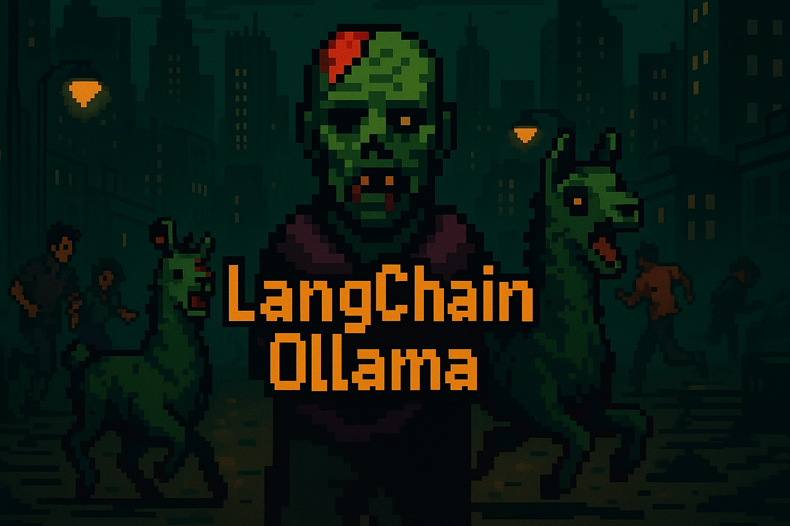

# LangChainOllama

[](https://www.python.org/downloads/) [](LICENSE)

<div align="center">
  
</div>


ชุดตัวอย่าง LangChain + Ollama สำหรับงาน AI Agent ภาษาไทย/อังกฤษ

## Table of Contents
- [Features](#features)
- [ติดตั้ง](#วิธีติดตั้ง)
- [การใช้งานเบื้องต้น](#วิธีใช้งานเบื้องต้น)
- [ภาพรวมของระบบ](#ภาพรวมของระบบ)
- [Workflow ใหม่](#workflow-ใหม่)
- [Best Practices](#best-practices)

## Features
- รองรับ LLM จาก Ollama (เช่น llama3.2:3b, qwen3:1.7b)
- ตัวอย่าง Agent หลากหลายรูปแบบ (Basic, RAG, SQL, Tool+Memory, Web, Fact-check, Creative, Summarization, PDF Q&A, Multi-Document RAG, **Translation, Web Search**, **Knowledge Graph**, **Sentiment Analysis**, **Text Classification**, **Data Extraction**, **Code Generation**)
- ใช้ FAISS + HuggingFace Embeddings สำหรับ RAG
- Agent พร้อม memory, error handling, logging และ input validation
- รองรับภาษาไทยและอังกฤษ (Native)
- รองรับ batch/bulk operation ในหลาย agent (เช่น การแปล, การสรุป, การจัดประเภท, การสกัดข้อมูล)
- Knowledge Graph Triplet Extraction (สร้างกราฟความรู้จากข้อความ)
- Sentiment Analysis ภาษาไทย/อังกฤษ
- Text Classification ภาษาไทย/อังกฤษ
- Data Extraction (สกัดข้อมูลบริษัท/ข้อมูลสำคัญจากข้อความ)
- Code Generation Agent (สร้างโค้ด Python พร้อมอธิบายและรันได้)

## วิธีติดตั้ง
1. ติดตั้ง Python >= 3.10
2. ติดตั้งแพ็กเกจที่จำเป็น:
   ```sh
   pip install langchain langchain-community langchain-ollama langchain-huggingface duckduckgo-search sqlite-utils python-dotenv
   ```
3. ติดตั้ง Ollama และดาวน์โหลดโมเดลที่ต้องการ (เช่น llama3.2:3b)
4. สร้างไฟล์ `.env` (ถ้าใช้ HuggingFace Embedding):
   ```env
   HF_TOKEN=your_huggingface_token
   ```

## วิธีใช้งานเบื้องต้น
- ใช้ LLM จาก Ollama ผ่าน `langchain_ollama.OllamaLLM` (รองรับ local LLM)
- ตัวอย่าง RAG ใช้ FAISS + HuggingFaceEmbeddings (รองรับ multilingual)
- SQL Agent ใช้ `langchain_community.agent_toolkits.create_sql_agent` เชื่อมต่อ SQLite
- Web Tool ใช้ DuckDuckGoSearchRun (DuckDuckGo อาจ rate limit ถ้าเรียกบ่อย)
- Fact-check Agent ใช้ 2 LLM: ตัวแรกค้นหา, ตัวที่สองวิจารณ์/ตรวจสอบ
- Creative Agent ใช้ Prompt Chaining (สร้างเรื่อง + แปลง style)
- ตัวอย่างทั้งหมดรองรับภาษาไทยและอังกฤษ

## ภาพรวมของระบบ
<details>
<summary>คลิกเพื่อดูภาพรวม</summary>

```
┌─────────────────────────────────────────────────────────────────────────┐
│                    LangChain + Ollama Agent System                     │
├─────────────────────────────────────────────────────────────────────────┤
│                                                                         │
│  ┌─────────────┐    ┌─────────────┐    ┌─────────────┐                  │
│  │ Basic Agent │    │  RAG Agent  │    │ SQL Agent   │                  │
│  │             │    │             │    │             │                  │
│  │ • Chat      │    │ • Vector DB │    │ • SQLite    │                  │
│  │ • Q&A       │    │ • Documents │    │ • Queries   │                  │
│  └─────────────┘    └─────────────┘    └─────────────┘                  │
│                                                                         │
│  ┌─────────────┐    ┌─────────────┐    ┌─────────────┐                  │
│  │ Web Agent   │    │Creative     │    │Fact-Check   │                  │
│  │             │    │Agent        │    │Agent        │                  │
│  │ • Search    │    │ • Stories   │    │ • Verify    │                  │
│  │ • Real-time │    │ • Poems     │    │ • Critics   │                  │
│  └─────────────┘    └─────────────┘    └─────────────┘                  │
│                                                                         │
│  ┌─────────────┐    ┌─────────────┐                                     │
│  │ Translation │    │ Web Tool    │                                     │
│  │ Agent       │    │ Agent       │                                     │
│  │ • Multilang │    │ • DuckDuckGo│                                     │
│  │ • Detect    │    │ • Fallback  │                                     │
│  └─────────────┘    └─────────────┘                                     │
│                                                                         │
│                         ┌─────────────────┐                             │
│                         │  Ollama LLM     │                             │
│                         │                 │                             │
│                         │ • llama3.2:3b   │                             │
│                         │ • qwen3:1.7b    │                             │
│                         │ • Local Models  │                             │
│                         └─────────────────┘                             │
│                                                                         │
│  ┌─────────────────────────────────────────────────────────────────────┤
│  │                        Tools & Integration                          │
│  ├─────────────────────────────────────────────────────────────────────┤
│  │ Memory System │ Search Tools │ Database Tools │ File Processing     │
│  │               │              │                │                     │
│  │ • Chat History│ • DuckDuckGo │ • SQLite       │ • PDF               │
│  │ • Context     │ • Bing API   │ • PostgreSQL   │ • TXT               │
│  │ • Sessions    │ • Web Scrape │ • MySQL        │ • Markdown          │
│  └─────────────────────────────────────────────────────────────────────┘
└─────────────────────────────────────────────────────────────────────────┘
```

</details>

ระบบนี้แสดงให้เห็นถึงความสามารถหลากหลายของ LangChain เมื่อผสานกับ Ollama:

### 🤖 **Multi-Agent Architecture**
- **Basic Agent**: LLM พื้นฐานสำหรับการสนทนาและตอบคำถาม
- **RAG Agent**: ระบบค้นหาข้อมูลจากเอกสารด้วย Vector Database
- **SQL Agent**: Agent ที่สามารถสื่อสารกับฐานข้อมูลได้โดยตรง
- **Web Agent**: ค้นหาข้อมูลสดจากอินเทอร์เน็ตแบบ Real-time
- **Creative Agent**: สร้างสรรค์เนื้อหา เรื่องสั้น กลอน และบทความ
- **Fact-Check Agent**: ตรวจสอบความถูกต้องของข้อมูล
- **Summarization Agent**: สรุปเนื้อหายาว ๆ ให้กระชับ เข้าใจง่าย
- **PDF Q&A Agent**: ถามตอบข้อมูลจากไฟล์ PDF โดยตรง
- **Multi-Document RAG Agent**: ถามตอบจากหลายไฟล์/หลายแหล่งข้อมูล (TXT, PDF)
- **Translation Agent**: แปลข้อความและเอกสารระหว่างภาษาไทย อังกฤษ จีน ญี่ปุ่น ฯลฯ พร้อมตรวจจับภาษาอัตโนมัติ
- **Web Tool Agent**: ค้นหาข้อมูลสดจากอินเทอร์เน็ตแบบ Real-time ด้วย DuckDuckGo Search (รองรับ fallback หลายกลยุทธ์)
- **Knowledge Graph Agent**: สร้างกราฟความรู้จากข้อความ
- **Sentiment Analysis Agent**: วิเคราะห์อารมณ์ของข้อความ
- **Text Classification Agent**: จัดประเภทข้อความ
- **Data Extraction Agent**: สกัดข้อมูลสำคัญจากข้อความ
- **Code Generation Agent**: สร้างโค้ด Python พร้อมอธิบายและรันได้

### 🔧 **Tool Integration**
- **Memory System**: จดจำบริบทการสนทนาแบบต่อเนื่อง
- **Search Tools**: DuckDuckGo, Bing Search API integration
- **Database Tools**: SQLite, PostgreSQL, MySQL support
- **File Processing**: PDF, TXT, Markdown document processing

### 🌐 **Multi-Language Support**
- รองรับภาษาไทยและอังกฤษแบบ Native
- ใช้ Multilingual Embedding Models
- Prompt Engineering สำหรับภาษาไทยโดยเฉพาะ

---

> ตัวอย่างนี้เหมาะสำหรับนักพัฒนา AI, นักวิจัย, นักเขียน, นักวิเคราะห์ข่าว และผู้สนใจ LangChain/Ollama

<div align="center">
  
</div>

## ตัวอย่างผลลัพธ์

### 📊 **SQL Agent ในการใช้งานจริง**
```python
# ตัวอย่างการถามข้อมูลจากฐานข้อมูล
query = "มีใครบ้างในฐานข้อมูล และอายุเท่าไร?"
response = agent_executor.invoke({"input": query})
# ผลลัพธ์: "ในฐานข้อมูลมี Alice อายุ 30 ปี และ Bob อายุ 25 ปี"
```

<div align="center">
  
  <p><i>ตัวอย่างการทำงานของ SQL Agent - ถาม-ตอบกับฐานข้อมูล SQLite</i></p>
</div>

### 🎨 **Creative Writing Agent**
```python
# สร้างเรื่องสั้นและแปลงเป็นกลอน
idea = "เด็กชายคนหนึ่งพบไข่มังกรในป่า"
result = creative_chain.invoke(idea)
# ผลลัพธ์: เรื่องสั้นแฟนตาซีและกลอนสุภาพ 4 บท
```

<div align="center">
  
  <p><i>ตัวอย่างการทำงานของ Creative Agent - สร้างเรื่องสั้นและแปลงเป็นกลอน</i></p>
</div>

### 📚 **RAG System**
```python
# ตอบคำถามจากเอกสาร
query = "AI ช่วยงานอะไรได้บ้าง?"
response = rag_chain.invoke({"query": query})
# ผลลัพธ์: คำตอบที่อ้างอิงจากเอกสารในระบบ
```

<div align="center">
  
  <p><i>ตัวอย่างการทำงานของ RAG System - ตอบคำถามจากเอกสารด้วย Vector Database</i></p>
</div>

### 🎯 **Basic LLM Pipeline**
```python
# ตัวอย่างการใช้งาน LLM แบบพื้นฐาน
topic = "กลศาสตร์ควอนตัม"
result = chain.invoke({"topic": topic})
# ผลลัพธ์: คำอธิบายที่เข้าใจง่ายเกี่ยวกับหัวข้อที่ถาม
```

<div align="center">
  
  <p><i>ตัวอย่างการทำงานของ Basic LLM Pipeline - อธิบายหัวข้อให้เข้าใจง่าย</i></p>
</div>

### 📖 **Translation Agent**
```python
# ตัวอย่างการแปลข้อความและตรวจจับภาษาอัตโนมัติ
agent = EnhancedTranslationAgent(model_name="llama3.2:3b")
result = agent.translate("สวัสดีครับ วันนี้อากาศดีมาก", target_language="en")
# ผลลัพธ์: TranslationResult(original_text='สวัสดีครับ วันนี้อากาศดีมาก', translated_text='Hello, the weather is very nice today.', ...)

# ตรวจจับภาษา
lang_info = agent.detect_language("こんにちは")
# ผลลัพธ์: {'language': 'ญี่ปุ่น', 'language_code': 'ja', 'confidence': 'กลาง'}
```

<div align="center">
  
  <p><i>ตัวอย่างการทำงานของ Translation Agent - แปลและตรวจจับภาษาอัตโนมัติ</i></p>
</div>

### 🌐 **Web Tool Agent**
```python
# ตัวอย่างการค้นหาข้อมูลสดจากอินเทอร์เน็ต
agent = create_search_agent(model="qwen3:1.7b")
response = agent.query("ข่าวเทคโนโลยี AI ล่าสุดวันนี้")
# ผลลัพธ์: {"success": True, "output": "Final Answer: ...", ...}

# รองรับ fallback หลายกลยุทธ์ (API, HTML, simplified query)
```

<div align="center">
  
  <p><i>ตัวอย่างการทำงานของ Web Tool Agent - ค้นหาข้อมูลสดและรองรับ fallback</i></p>
</div>

## ความพิเศษของ LangChain + Ollama

### 🚀 **Performance Benefits**
- **Local Processing**: ไม่ต้องส่งข้อมูลออกนอกเครื่อง
- **Cost Effective**: ไม่มีค่าใช้จ่าย API calls
- **Customizable**: ปรับแต่งโมเดลได้ตามต้องการ
- **Privacy**: ข้อมูลไม่ออกจากเครื่องของคุณ

### 💡 **Use Cases**
- **ผู้พัฒนา**: สร้าง AI Assistant สำหรับงานเขียนโค้ด
- **นักวิจัย**: วิเคราะห์เอกสารและข้อมูลขนาดใหญ่
- **นักเขียน**: ช่วยสร้างสรรค์เนื้อหาและตรวจสอบข้อเท็จจริง
- **นักธุรกิจ**: วิเคราะห์ข้อมูลและสร้างรายงาน

### 🔧 **Technical Advantages**
- **Modular Design**: แยกส่วนงานได้ชัดเจน
- **Extensible**: เพิ่ม Agent ใหม่ได้ง่าย
- **Multi-Modal**: รองรับข้อมูลหลายรูปแบบ
- **Production Ready**: พร้อมใช้งานจริง

## การติดตั้งและใช้งานขั้นสูง

### 🐳 **Docker Deployment**
```dockerfile
FROM python:3.11-slim
WORKDIR /app
COPY requirements.txt .
RUN pip install -r requirements.txt
COPY . .
CMD ["python", "LangChainBasic.py"]
```

### ⚙️ **Environment Configuration**
```bash
# ตั้งค่าตัวแปรสิ่งแวดล้อม
export OLLAMA_HOST=localhost:11434
export LANGCHAIN_TRACING_V2=true
export LANGCHAIN_API_KEY=your_api_key
```

### 📊 **Performance Monitoring**
```python
# ตรวจสอบประสิทธิภาพ
from langchain.callbacks import get_openai_callback
with get_openai_callback() as cb:
    result = agent.invoke("your query")
    print(f"Tokens used: {cb.total_tokens}")
```

## 🗺️ ตัวอย่าง Workflow ของแต่ละ Agent (Mermaid Diagram)

> **หมายเหตุ:** Diagram เหล่านี้ช่วยให้มือใหม่เข้าใจลำดับการทำงานของแต่ละสคริปต์/Agent ได้ง่ายขึ้น สามารถนำไปปรับใช้หรือขยายต่อยอดได้

### 1. Basic Agent (`LangChainBasic.py`)


**อธิบาย:**
- รับข้อความ/หัวข้อจากผู้ใช้ (ผ่าน CLI หรือฟังก์ชัน)
- ตรวจสอบ input, handle error, validate
- เตรียม prompt และ chain
- ส่งเข้า LLM, รับผลลัพธ์, แสดงผล
- รองรับ batch explain และ custom prompt

---

### 2. RAG Agent (`LangChainRAG.py`)

```mermaid
graph TD
    A[รับ path ไฟล์/คำถามจากผู้ใช้] --> B[ตรวจสอบไฟล์/โหลดเอกสาร]
    B --> C[แปลงเอกสารเป็น chunks]
    C --> D[สร้างเวกเตอร์สโตร์ (FAISS + Embedding)]
    D --> E[ตั้งค่า QA Chain (PromptTemplate + Retriever)]
    E --> F[รับคำถามจากผู้ใช้]
    F --> G[แปลงคำถามเป็นเวกเตอร์]
    G --> H[ค้นหา context ที่เกี่ยวข้อง]
    H --> I[รวม context + คำถาม]
    I --> J[ส่งเข้า LLM]
    J --> K[แสดงคำตอบ + แหล่งอ้างอิง]
    B -. error .-> L[handle error/logging]
```

**อธิบาย:**
- โหลดไฟล์, แบ่ง chunk, สร้างเวกเตอร์, ตั้งค่า chain
- ถาม > ค้น context > รวม > ส่งเข้า LLM > ตอบ

---

### 3. Multi-Document RAG Agent (`LangChainMultiDocRAGAgent.py`)

```mermaid
graph TD
    A[รับไฟล์หลายไฟล์/ประเภท (TXT, PDF)] --> B[โหลดและแบ่งเอกสารทั้งหมด]
    B --> C[สร้างเวกเตอร์สโตร์ (FAISS)]
    C --> D[ตั้งค่า QA Chain]
    D --> E[รับคำถามจากผู้ใช้]
    E --> F[ค้นหา context จากหลายแหล่ง]
    F --> G[รวม context + คำถาม]
    G --> H[ส่งเข้า LLM]
    H --> I[แสดงคำตอบ + แหล่งอ้างอิง]
    B -. error .-> J[handle error/logging]
```

**อธิบาย:**
- รองรับหลายไฟล์/หลายประเภท, batch, handle error

---

### 4. SQL Agent (`LangChainSQL.py`)

```mermaid
graph TD
    A[รับคำถาม SQL จากผู้ใช้] --> B[วิเคราะห์ intent]
    B --> C[สร้าง SQL Query]
    C --> D[รัน SQL กับฐานข้อมูล (SQLite)]
    D --> E[แปลงผลลัพธ์เป็นข้อความ]
    E --> F[แสดงผลลัพธ์]
    F --> G[บันทึก query history]
    F -. analytics .-> H[สร้าง dashboard/analytics]
    F -. suggest .-> I[แนะนำคำถาม]
    A -. error .-> J[handle error/logging]
```

**อธิบาย:**
- ถาม > วิเคราะห์ > สร้าง query > รัน > ตีความผลลัพธ์ > ตอบ
- รองรับ analytics, suggest, export history

---

### 5. Web Tool Agent (`LangChainWebTool.py`)

```mermaid
graph TD
    A[รับคำถามจากผู้ใช้] --> B[เลือก search tool (DuckDuckGo/Bing)]
    B --> C[ค้นหาข้อมูลสดจากเว็บ (API/HTML)]
    C --> D[สกัด/สรุปผลลัพธ์]
    D --> E[ส่งเข้า LLM (ถ้ามี)]
    E --> F[แสดงผลลัพธ์]
    C -. fallback .-> G[ลองกลยุทธ์ fallback อื่น]
    A -. error .-> H[handle error/logging]
```

**อธิบาย:**
- ถาม > ค้นเว็บ > สรุป > (ส่งเข้า LLM) > ตอบ
- มี fallback หลายกลยุทธ์

---

### 6. Translation Agent (`LangChainTranslationAgent.py`)


**อธิบาย:**
- รับข้อความ > ตรวจจับภาษา > แปล > ตอบ
- รองรับ batch, context-aware, export stats

---

### 7. PDF Q&A Agent (`LangChainPDFQAAgent.py`)


**อธิบาย:**
- รับ PDF > แปลง > chunk > vector > QA chain > ถาม LLM > ตอบ

---

### 8. Knowledge Graph Agent (`LangChainKnowledgeGraphAgent.py`)

```mermaid
graph TD
    A[รับข้อความ] --> B[สกัด triplet (subject, predicate, object)]
    B --> C[สร้าง/อัปเดตกราฟความรู้ (networkx)]
    C --> D[รับคำถามเกี่ยวกับกราฟ]
    D --> E[ตั้งค่า prompt/query LLM]
    E --> F[แสดงผลลัพธ์/Node ที่เกี่ยวข้อง]
    A -. error .-> G[handle error/logging]
```

**อธิบาย:**
- รับข้อความ > สกัด triplet > อัปเดตกราฟ > query node > ตอบ

---

### 9. Sentiment Analysis Agent (`LangChainSentimentAgent.py`)

```mermaid
graph TD
    A[รับข้อความ] --> B[ส่งเข้า LLM วิเคราะห์อารมณ์]
    B --> C[แสดงผลลัพธ์ (บวก/ลบ/กลาง พร้อมเหตุผล)]
    A -. batch .-> D[วิเคราะห์หลายข้อความ]
    A -. error .-> E[handle error/logging]
```

**อธิบาย:**
- รับข้อความ > วิเคราะห์อารมณ์ > ตอบ (รองรับ batch)

---

### 10. Text Classification Agent (`LangChainTextClassificationAgent.py`)

```mermaid
graph TD
    A[รับข้อความ] --> B[ส่งเข้า LLM จัดประเภท]
    B --> C[แสดงผลลัพธ์ (หมวดหมู่, ความมั่นใจ, เหตุผล)]
    A -. batch .-> D[จัดประเภทหลายข้อความ]
    C -. distribution .-> E[สรุปการกระจายหมวดหมู่]
    A -. error .-> F[handle error/logging]
```

**อธิบาย:**
- รับข้อความ > จัดประเภท > ตอบ (รองรับ batch, สรุป distribution)

---

### 11. Data Extraction Agent (`LangChainDataExtractionAgent.py`)

```mermaid
graph TD
    A[รับข้อความ] --> B[ส่งเข้า LLM สกัดข้อมูลสำคัญ]
    B --> C[แสดงข้อมูลที่สกัดได้ (JSON)]
    A -. batch .-> D[สกัดข้อมูลหลายข้อความ]
    C -. export .-> E[ส่งออกผลลัพธ์เป็นไฟล์]
    A -. error .-> F[handle error/logging]
```

**อธิบาย:**
- รับข้อความ > สกัดข้อมูล > ตอบ (รองรับ batch, export)

---

### 12. Code Generation Agent (`LangChainCodeGenAgent.py`)

```mermaid
graph TD
    A[รับคำสั่ง/คำอธิบายจากผู้ใช้] --> B[ส่งเข้า LLM สร้างโค้ด]
    B --> C[แยกโค้ด/อธิบาย/ความซับซ้อน]
    C --> D[validate syntax (optional)]
    D --> E[รันโค้ด (ถ้ามี)]
    E --> F[แสดงผลลัพธ์]
    F -. save .-> G[บันทึกโค้ดลงไฟล์]
    F -. test .-> H[รัน test cases]
    A -. error .-> I[handle error/logging]
```

**อธิบาย:**
- รับคำสั่ง > สร้างโค้ด > อธิบาย/validate > รัน/บันทึก/test > ตอบ

---

### 13. Creative Agent (`LangChainCreativeAgent.py`)

```mermaid
graph TD
    A[รับไอเดีย/คำสั่งจากผู้ใช้] --> B[เลือกประเภทเนื้อหา (story/poem/dialog/description)]
    B --> C[เตรียม PromptTemplate เฉพาะ]
    C --> D[ส่งเข้า LLM สร้างเนื้อหา]
    D --> E[แสดงผลงานสร้างสรรค์]
    A -. batch .-> F[สร้างหลายผลงาน]
    A -. error .-> G[handle error/logging]
```

**อธิบาย:**
- รับไอเดีย > เลือกประเภท > เตรียม prompt > สร้างเนื้อหา > ตอบ (รองรับ batch)

---

### 14. Summarization Agent (`LangChainSummarizationAgent.py`)

```mermaid
graph TD
    A[รับข้อความ/ไฟล์ยาว] --> B[เลือกประเภทสรุป (brief/detailed/bullets/keywords/abstract)]
    B --> C[แบ่ง chunk ถ้ายาว]
    C --> D[ส่งเข้า LLM สรุปทีละ chunk]
    D --> E[รวมผลลัพธ์แต่ละ chunk]
    E --> F[แสดงสรุป]
    F -. save .-> G[บันทึกสรุปลงไฟล์]
    A -. batch .-> H[สรุปหลายข้อความ]
    A -. error .-> I[handle error/logging]
```

**อธิบาย:**
- รับข้อความ/ไฟล์ > เลือกประเภท > chunk > สรุป > รวม > ตอบ (รองรับ batch, save)

---

### 15. Tool+Memory Agent (`LangChainToolMemory.py`)

```mermaid
graph TD
    A[รับข้อความ/คำถามจากผู้ใช้] --> B[เลือก Tool ที่เหมาะสม (API/คำนวณ/เวลา/อัตราแลกเปลี่ยน)]
    B --> C[เรียกใช้งาน Tool จริง]
    C --> D[บันทึก context/conversation memory]
    D --> E[ส่งเข้า LLM (ถ้ามี)]
    E --> F[แสดงผลลัพธ์]
    A -. clear .-> G[ล้าง memory]
    A -. error .-> H[handle error/logging]
```

**อธิบาย:**
- รับข้อความ > เลือก tool > เรียกใช้งาน > บันทึก memory > ตอบ (รองรับ clear memory)

---

### 16. Fact-Check Agent (`LangChainFactCheckAgent.py`)

```mermaid
graph TD
    A[รับ claim/ข้ออ้างจากผู้ใช้] --> B[สร้าง search queries หลายแบบ]
    B --> C[ค้นหาข้อมูล/หลักฐานจากเว็บ]
    C --> D[รวบรวม evidence/sources]
    D --> E[ส่งเข้า LLM วิเคราะห์/วิจารณ์]
    E --> F[แสดง verdict (จริง/เท็จ/ไม่แน่ใจ) พร้อมเหตุผล]
    A -. error .-> G[handle error/logging]
```

**อธิบาย:**
- รับ claim > ค้นหา > รวบรวม evidence > วิเคราะห์ > ตอบ verdict

---

## Best Practices

- ตรวจสอบ resource consumption ของ LLM/embedding
- DuckDuckGo Search อาจ rate limit หากเรียกบ่อย
- ตรวจสอบ license ของ model/embedding ที่ใช้งาน
- ใช้ reverse proxy และจำกัด access เมื่อ deploy จริง
- ใช้ .env สำหรับ key/token ทุกชนิด
- **ขยายไอเดียใหม่**: เพิ่ม agent สำหรับค้นหาไอเดีย, สร้างเนื้อหาใหม่, หรือวิเคราะห์แนวโน้มเทคโนโลยีได้ง่ายด้วยการเพิ่มไฟล์ agent ใหม่และเชื่อมต่อกับ LLM

## อัปเดตล่าสุด
- ปรับปรุง error handling, logging, input validation
- เพิ่มตัวอย่าง workflow สำหรับ Production-ready
- ลบรายการซ้ำและจัดระเบียบเนื้อหา